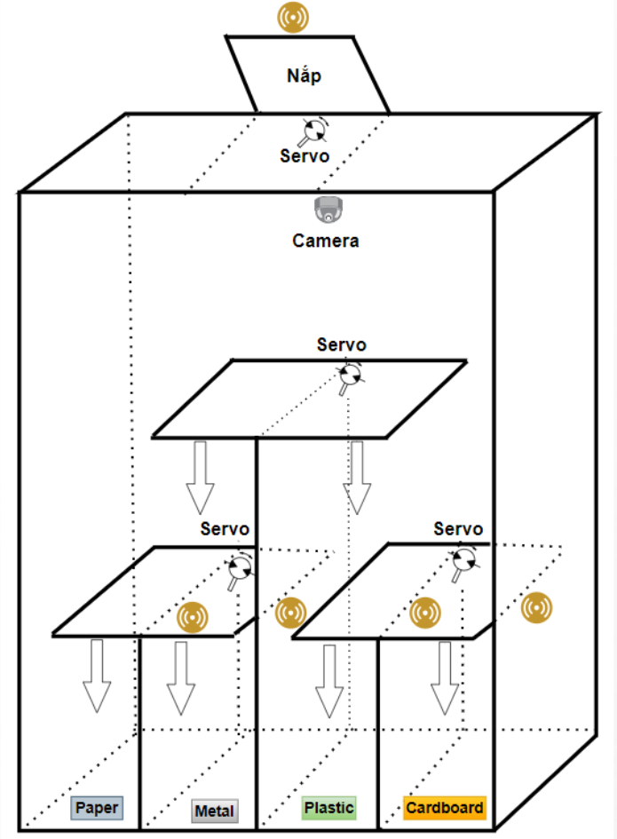
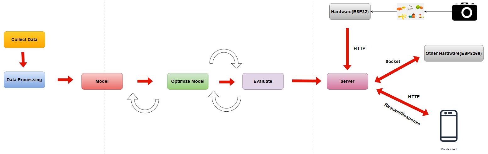

# Smart Trash Project

## Table of Contents
- [Description](#description)
- [Design System](#design-system)
- [Installation Guide](#installation-guide)
- [Usage](#usage)
- [Directory Structure](#directory-structure)
- [Contributing](#contributing)
- [License](#license)
- [Contact](#contact)

# Description
## 1. Design and Build of Smart Trash Bins:
- We have designed and constructed smart trash bins that are compact and suitable for various public settings such as schools, parks, residential areas, and commercial zones.
- These bins are partitioned into multiple compartments to accommodate different types of waste, including paper, plastic, and metal.

## 2. Integration of Camera and Image Processing System:
- Each trash bin is equipped with an internal camera to capture images of deposited waste.
- The images are transmitted to a server for processing, facilitating real-time analysis of waste content.

## 3.AI Model Application for Waste Classification:
- Utilizing advanced AI technology, our server deploys models to analyze and categorize waste based on the images received from ESP32 cameras.
- This automated classification system enhances efficiency in waste management processes.

## 4. Mechanism for Compartment Rotation:
- Our smart bins feature a mechanical system that rotates compartments according to the waste type identified by the AI model.
- This ensures precise segregation and facilitates easier waste collection and recycling.

## 5. Management and Monitoring via Server System:
- A centralized server manages and monitors the status of each trash bin in real-time.
- It provides an intuitive interface for administrators to track fill levels, optimize collection routes, and promptly respond to bin capacity.

# Design System
## 1.Model

## 2.IOT System

## 3.AI Flow

## Installation Guide
Detailed instructions on setting up the development environment and required software to run the project.

## Usage
Instructions for users on how to use your product or service, including configurations, basic commands, and illustrative examples.

## Directory Structure
Describe the project's directory structure, making it easy for readers to locate important parts such as source code, documentation, data, etc.

## Contributing
Guide users on how to contribute to your project, including pull request processes and naming/formatting conventions.

## License
Specify the terms and conditions for licensing, allowing reuse of the source code, including popular licenses such as MIT, Apache, etc.

## Contact
Provide contact information for questions, contributions, or bug reports.
