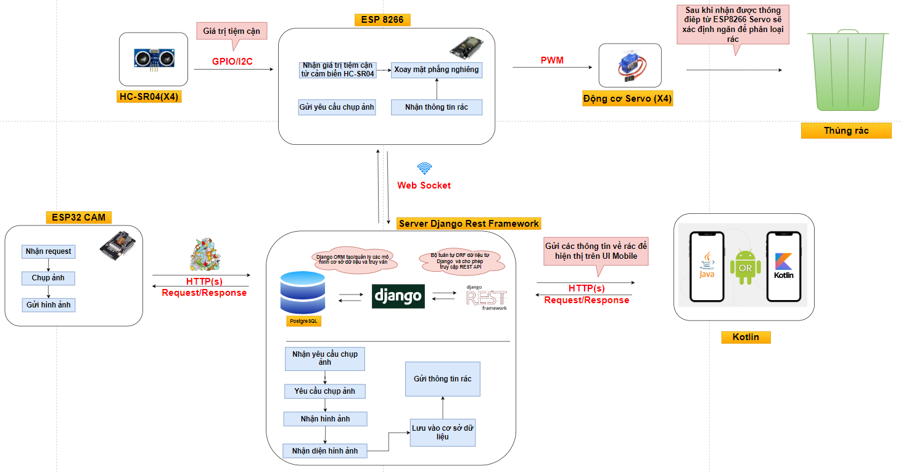

# Smart Trash Project

## Table of Contents
- [Description](#description)
- [Design System](#design-system)
- [Installation Guide](#installation-guide)
- [Contributing](#contributing)
- [Contact](#contact)

# Description
## 1. Design and Build of Smart Trash Bins:
- We have designed and constructed smart trash bins that are compact and suitable for various public settings such as schools, parks, residential areas, and commercial zones.
- These bins are partitioned into multiple compartments to accommodate different types of waste, including paper, plastic, and metal.

## 2. Integration of Camera and Image Processing System:
- Each trash bin is equipped with an internal camera to capture images of deposited waste.
- The images are transmitted to a server for processing, facilitating real-time analysis of waste content.

## 3.AI Model Application for Waste Classification:
- Utilizing advanced AI technology, our server deploys models to analyze and categorize waste based on the images received from ESP32 cameras.
- This automated classification system enhances efficiency in waste management processes.

## 4. Mechanism for Compartment Rotation:
- Our smart bins feature a mechanical system that rotates compartments according to the waste type identified by the AI model.
- This ensures precise segregation and facilitates easier waste collection and recycling.

## 5. Management and Monitoring via Server System:
- A centralized server manages and monitors the status of each trash bin in real-time.
- It provides an intuitive interface for administrators to track fill levels, optimize collection routes, and promptly respond to bin capacity.


# Design System
## 1. Model

## 2. IOT System

## 3. AI Flow


## Installation Guide
Ensure you have Python 3.9+ installed. Then, install the required dependencies using pip:

```bash
pip install Django==4.2.10
pip install djangorestframework==3.14.0
pip install google-auth==2.28.1
pip install google-auth-oauthlib==1.2.0
pip install keras==2.15.0
pip install numpy==1.26.4
pip install pillow==10.2.0
pip install psycopg2==2.9.9
pip install python-dotenv==1.0.1
pip install tensorflow==2.15.0
pip install djangorestframework-simplejwt
```

## License
This project is licensed under the [MIT License](https://opensource.org/licenses/MIT) - see the [LICENSE](LICENSE) file for details.

You are free to:
- Use the source code for personal or commercial purposes.
- Modify the source code.
- Distribute copies of the source code.

Under the following conditions:
- Include the original copyright notice and license in any copy of the project.
- State any changes made to the code.
- Include a disclaimer stating that the software is provided "as is", without warranty of any kind.

You are not required to:
- Provide the source code or changes back to the community.
- Share any modifications you make to the source code.

By contributing to this repository, you agree to license your contributions under the same terms.

For questions or inquiries about commercial licensing, please contact [hoangcongtrong02.dut@gmail.com].

## Contact
For questions, contributions, or bug reports, please feel free to reach out:

- Email: [hoangcongtrong02.dut@gmail.com](hoangcongtrong02.dut@gmail.com)
- Linkedin: [https://www.linkedin.com/in/hoangtrong151102/](https://www.linkedin.com/in/hoangtrong151102/)
- Instagram: [https://www.instagram.com/h.c.trong_02/](https://www.instagram.com/h.c.trong_02/)

We appreciate your feedback and involvement!
